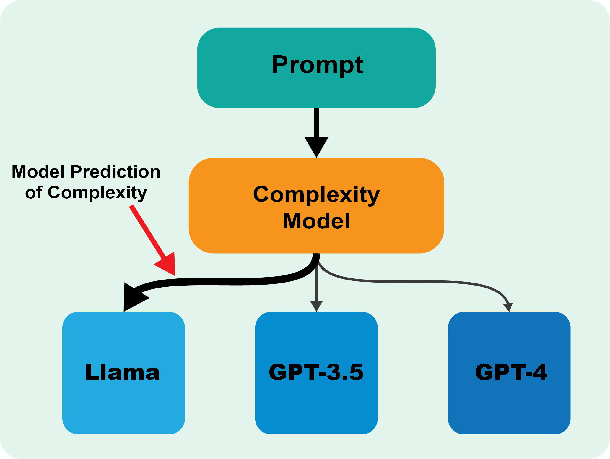

## Introduction 
We present ComplexityNet, a streamlined language
model designed for assessing task complexity. This model predicts
the likelihood of accurate output by various language models,
each with different capabilities. Our initial application of Com-
plexityNet involves the Mostly Basic Python Problems (MBPP)
dataset. We pioneered the creation of the first set of labels to
define task complexity. ComplexityNet achieved a notable 79%
accuracy in determining task complexity, a significant improve-
ment over the 34% accuracy of the original model. Furthermore,
ComplexityNet effectively reduces computational resource usage
by 57% , while maintaining a high code generation accuracy of
90%. This study demonstrates that fine-tuning smaller models to
categorize tasks based on their complexity can lead to a more
balanced trade-off between accuracy and efficiency in the use
of Large Language Models. Our findings suggest a promising
direction for optimizing LLM applications, especially in resource-
constrained environments.

## Repository Structure
The dataset folder includes the Jupyter Notebooks that create the dataset for all of `Code Llama`, `GPT-3.5`, and `GPT-4`. Different versions of the dataset we generated can be found there too.

The `fine-tuning` folder contains the Jupyter Notebooks used to fine-tune the complexity model. The `dataset_prep_completion.ipynb` notebook creates a dataset compatible with the OpenAI API fine-tuning format for completion models from the previous format. The `dataset_prep_chat.ipynb` notebook does the same thing for chat models. The `fine_tuning_completion.ipynb` notebook uses the dataset created by the previous files to fine-tune a completion model using the OpenAI API. The `fine_tuning_chat.ipynb` notebook does the same thing for a chat model.
There's one version for fine-tuning completion models, like `Davinice-002` and another for fine-tuning chat-based models like `GPT-3.5`
